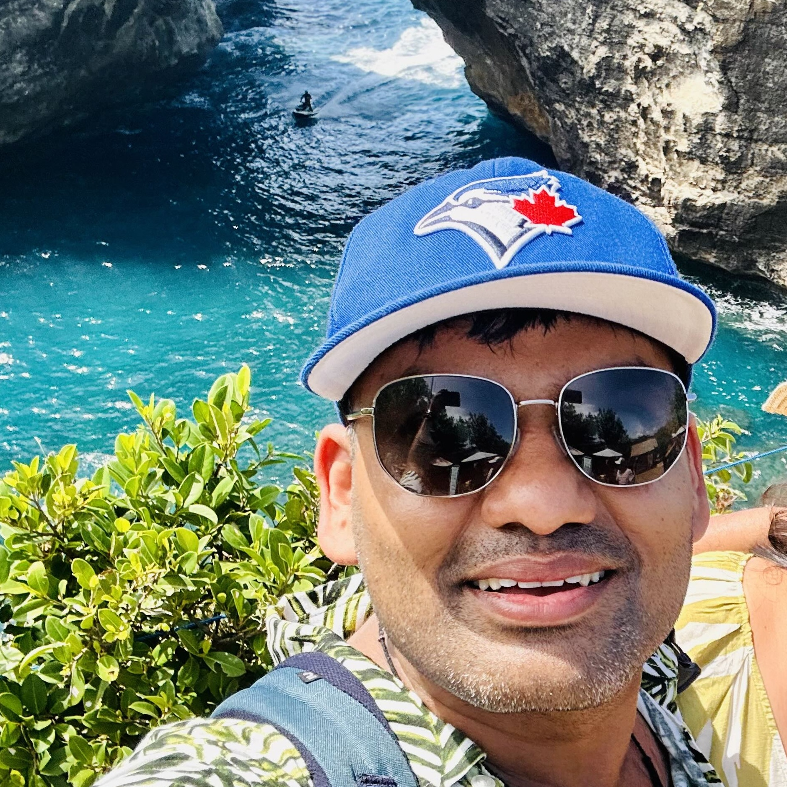

::: {layout="[21,79]" .profile-header}

{.profile-pic fig-alt="Aayush Garg"}

I am a Senior ML Engineer who builds and ships production generative AI systems, from image enhancement pipelines to multi-agent systems. At Jiffy, I build the core image enhancement pipeline, architect multi-agent editing systems and deploy custom ML/LLM models at scale.

:::

## 💼 Current Work

I work at the intersection of computer vision and LLMs, building production AI systems that drive business impact. My background in computational geophysics keeps me grounded in first principles and pragmatic experimentation.

If you're interested in my work or want to collaborate, feel free to reach out via [email](mailto:aayushgargiitr@gmail.com) or connect on [LinkedIn](https://www.linkedin.com/in/aayush-garg-8b26a734) or [Twitter](https://twitter.com/Aayush_ander).

---

## 📮 Blog

I write about LLM fundamentals, fine-tuning experiments, and building reliable AI systems. Below are my recent posts.

::: {#blog-listings}
:::

## 📬 Reach Out

The best way to follow my work is on [GitHub](https://github.com/garg-aayush), [Twitter](https://twitter.com/Aayush_ander), or [LinkedIn](https://www.linkedin.com/in/aayush-garg-8b26a734).

::: {.template-credit}
*Template inspired by [hamel.dev](https://hamel.dev/) and [Lil'Log](https://lilianweng.github.io/).*
:::
